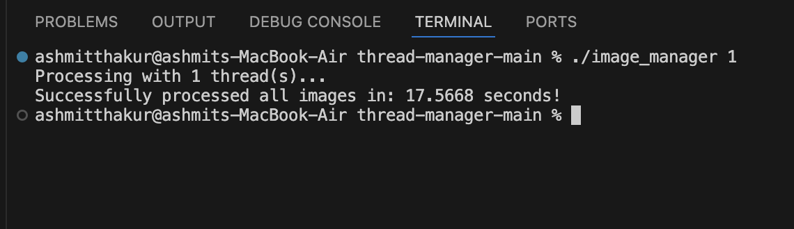
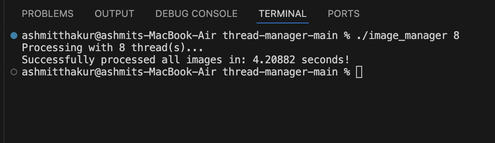

# Thread Pool Image Processor

A C++17 multithreaded image processing tool that converts color images to grayscale using a custom thread pool built from scratch.

## What it does

- Implements a **thread pool** from scratch using C++ concurrency primitives (`std::thread`, `std::mutex`, `std::condition_variable`)
- Batch-processes all images in an input directory concurrently
- Converts each image to grayscale using the luminosity formula: `gray = 0.21R + 0.72G + 0.07B`
- Accepts thread count as a CLI argument so you can benchmark any configuration

## Setup

### Prerequisites

- macOS with Xcode Command Line Tools (`xcode-select --install`)
- Or any Linux system with `g++` / `clang++`

### 1. Clone the repo

```bash
git clone https://github.com/yourusername/thread-manager-main.git
cd thread-manager-main
```

### 2. Add your images

Place any `.jpg`, `.png`, or `.bmp` images inside the `input_images/` folder.

### 3. Compile

```bash
clang++ -std=c++17 -O2 -o image_manager mainfile.cpp
```

### 4. Run

```bash
./image_manager <num_threads>
```

**Examples:**

```bash
# Single-threaded
./image_manager 1

# 8 threads (recommended for modern hardware)
./image_manager 8

# Use all available cores
./image_manager $(sysctl -n hw.logicalcpu)
```

Output images are saved to `output_images/` automatically.

## Demo

| Before | After |
|--------|-------|
|  |  |

## Benchmark Results

Tested on **Apple M4** (macOS) — 24 high-resolution JPEG images, total ~104MB.

| Threads | Time    | Speedup |
|---------|---------|---------|
| 1       | 17.57 s | 1x      |
| 8       | 4.21 s  | ~4x     |

**~4x speedup** with 8 threads.

**1 thread:**


**8 threads:**
 The bottleneck shifts to disk I/O on large files, which prevents linear scaling — but the concurrent decode/encode pipeline still yields significant gains on real-world workloads.

## Thread Pool Design

```
Main Thread
    │
    ├── enqueue(task_1) ─┐
    ├── enqueue(task_2)  │   ┌─ Worker Thread 1 ── process_image()
    ├── enqueue(task_3)  ├──►│   Worker Thread 2 ── process_image()
    └── enqueue(task_N) ─┘   └─ Worker Thread N ── process_image()
```

- Worker threads block on a condition variable when the queue is empty — zero busy-waiting
- A single `std::mutex` guards the task queue
- The pool destructor sets a stop flag and calls `join()` on all workers — no tasks are dropped mid-run

## Tech Stack

- **Language:** C++17
- **Image I/O:** `stb_image` / `stb_image_write` (header-only, no external dependencies)
- **Concurrency:** `<thread>`, `<mutex>`, `<condition_variable>`, `<functional>`
